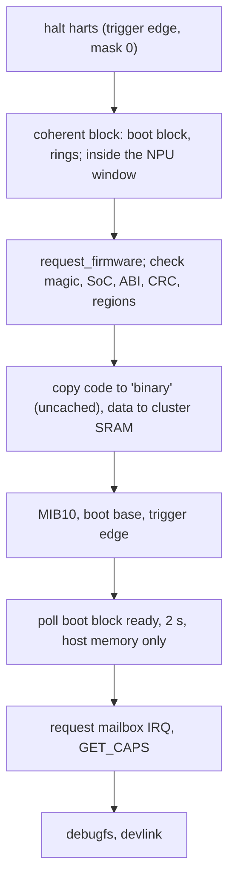

# Host driver `libranpu`

| file | content |
|---|---|
| `core.c` | DT match, image checks, load, boot handshake, halt, consumer lookup |
| `cmd.c` | command slots, event ring drain, fault words |
| `devlink.c` | `devlink dev info`: ASIC, firmware, ABI, build id |
| `debugfs.c` | bench only: `status`, `dbg_block`, `probe`, `cmd_bench` |

## Probe



- `BOOT_CONFIG` changes take effect only on a 0 to 1 write of `BOOT_TRIGGER`.
- The mailbox IRQ is requested after `ready`: its handler writes an NPU register.
- Remove: `RESET` (every hart parks, hart 0 last, after answering), halt, free.

## Commands

- The sequence number is the ring index; the slot of a `CMD_DONE` is `seq & 31`.
- A caller that times out marks its slot abandoned and the NPU unhealthy; the slot stays reserved
  until the NPU answers, so it never writes memory the host reused.
- The completion is signalled under the slot lock, so a late answer cannot race the abandon.
- Event drain: publish `evt_cons`, full barrier, read `evt_prod` again; an event posted while the host
  was draining raised no interrupt.
- Statuses outside the errno range read as `-EIO`; event types and lengths are bounds-checked.

## Consumer API (`include/linux/soc/airoha/libranpu.h`)

`libranpu_get/put` (from the `airoha,npu` phandle; refuses a node another driver owns),
`libranpu_caps`, `libranpu_cmd`, notifier (`LIBRANPU_FATAL`).

WLAN (`driver/wlan.c`): `libranpu_rx_pool` / `libranpu_rx_sync` (the `rx-pkt` pool, mapped once,
synced per frame), `libranpu_wlan_attach/start/stop/detach/force_host/stats`, host adaptor rings
(`ha_ring_init`, `ha_rx_prod/cons`, `ha_tx_prod/cons`) and lines (`ha_irq`, `ha_irq_enable`,
`ha_irq_ack`: each line acks only its own ring).

debugfs: `status`, `dbg_block`, `probe`, `cmd_bench`, `ha_probe`, `wlan_stats`, `wlan_force_host`
(bench switch; devlink later).

## DT

```dts
npu@1e900000 {
	compatible = "airoha,an7583-libranpu";
	reg = <0x0 0x1e900000 0x0 0x313000>;
	interrupts = <GIC_SPI 125 IRQ_TYPE_LEVEL_HIGH>;	/* mailbox first */
	memory-region = <&npu_binary>, <&npu_pkt>;
	memory-region-names = "binary", "rx-pkt";	/* rx-pkt without no-map */
};
```

Firmware: `airoha/<soc>-libranpu.bin`, or `firmware-name`.
