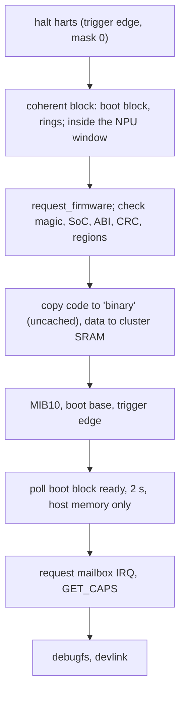
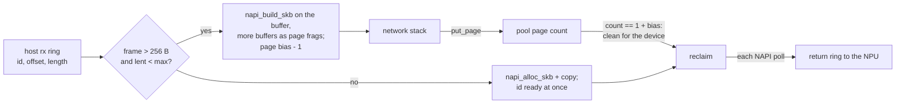

# Host driver `libranpu`

| file | content |
|---|---|
| `core.c` | DT match, image checks, load, boot handshake, halt, consumer lookup |
| `cmd.c` | command slots, event ring drain, fault words |
| `devlink.c` | `devlink dev info`: ASIC, firmware, ABI, build id |
| `debugfs.c` | bench only: `status`, `dbg_block`, `probe`, `cmd_bench` |

## Probe



- `BOOT_CONFIG` changes take effect only on a 0 to 1 write of `BOOT_TRIGGER`.
- The mailbox IRQ is requested after `ready`: its handler writes an NPU register.
- Remove: `RESET` (every hart parks, hart 0 last, after answering), halt, free.

## Commands

- The sequence number is the ring index; the slot of a `CMD_DONE` is `seq & 31`.
- A caller that times out marks its slot abandoned and the NPU unhealthy; the slot stays reserved
  until the NPU answers, so it never writes memory the host reused.
- The completion is signalled under the slot lock, so a late answer cannot race the abandon.
- Event drain: publish `evt_cons`, full barrier, read `evt_prod` again; an event posted while the host
  was draining raised no interrupt.
- Statuses outside the errno range read as `-EIO`; event types and lengths are bounds-checked.

## Consumer API (`include/linux/soc/airoha/libranpu.h`)

`libranpu_get/put` (from the `airoha,npu` phandle; refuses a node another driver owns),
`libranpu_caps`, `libranpu_cmd`, notifier (`LIBRANPU_FATAL`).

WLAN (`driver/wlan.c`): `libranpu_rx_pool` (the `rx-pkt` pool, mapped once),
`libranpu_wlan_attach` (fills in the pool, rx buffer layout and held ids),
`start/stop/detach/force_host/stats`, host adaptor rings (`ha_ring_init`, `ha_rx_prod/cons`,
`ha_tx_prod/cons`) and lines (`ha_irq`, `ha_irq_enable`, `ha_irq_ack`: each line acks only its
own ring). `libranpu_ha_tx_regs` gives a host adaptor tx ring's register block (base, size,
producer, consumer: a chip DMA ring's layout), so a WiFi driver's tx queue can drive it unchanged.

Rx buffers (`driver/rxbuf.c`): `libranpu_rx_skb` (a frame's buffers as one skb), `rx_drop`,
`rx_reclaim` (ids for the return ring). One NAPI context calls them.

debugfs: `status`, `dbg_block`, `probe`, `cmd_bench`, `ha_probe`, `wlan_stats` (NPU counters, then
`host_lent_frames`, `host_copied_frames`, `host_reclaimed`, `host_lent_now N of MAX`),
`wlan_force_host`, `wlan_rx_lend` (bench switches; devlink later).

## Zero-copy rx



| rule | why |
|---|---|
| chip writes at the buffer start, `SKB_WITH_OVERHEAD(2048)` = 1728 bytes | the stack's `skb_shared_info` fits after it; a full 802.3 frame and a 192-byte RXD fit in one buffer, as on the host rx path |
| the driver holds `USHRT_MAX` references per pool page and gives one to each lent buffer | no atomic per frame; the page count equals `1 + bias` again once every user dropped it (the page-reuse idiom of rx page-flip drivers) |
| reclaim checks at most 64 lent pages per poll; a busy page moves to the back | a socket that holds its buffers does not block the others |
| a reclaimed buffer is cleaned for the device (1728 bytes) | the stack may have written headers; no dirty line may land on the chip's next frame |
| lend limit `(pool - chip ring slots) / 2`, then copy | a socket that never reads cannot take the pool from the chip |
| frames of 256 bytes or less are copied | cheaper than a lend and a later clean; small ACKs do not pin 2 KB |
| pool pages keep the base reference of reserved memory | a count never reaches zero; an unload gives back only the bias |
| attach passes the ids still lent (`rx_held` bitmap) | the NPU keeps them out of the chip's rings until they come back on the return ring |
| a page with extra references at load is lent until they drop | a reload of the module while sockets hold buffers is safe |

## DT

```dts
npu@1e900000 {
	compatible = "airoha,an7583-libranpu";
	reg = <0x0 0x1e900000 0x0 0x313000>;
	interrupts = <GIC_SPI 125 IRQ_TYPE_LEVEL_HIGH>;	/* mailbox first */
	memory-region = <&npu_binary>, <&npu_pkt>;
	memory-region-names = "binary", "rx-pkt";	/* rx-pkt without no-map */
};
```

Firmware: `airoha/<soc>-libranpu.bin`, or `firmware-name`.
