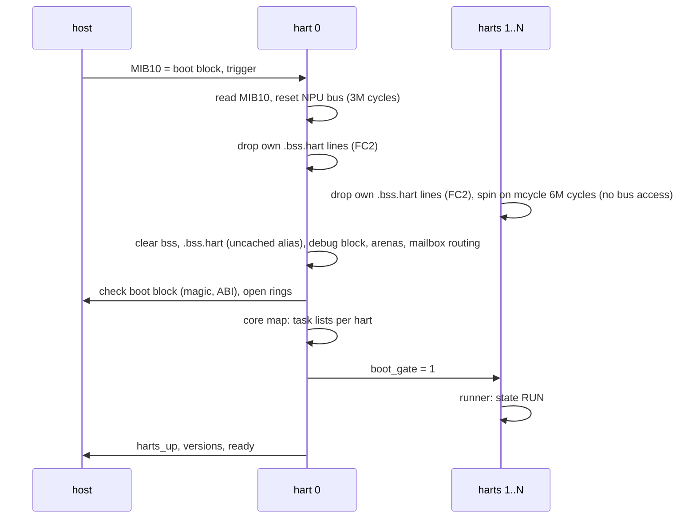
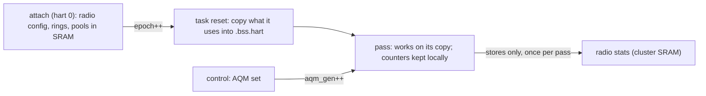
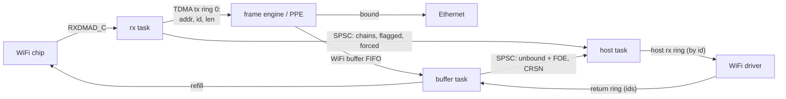
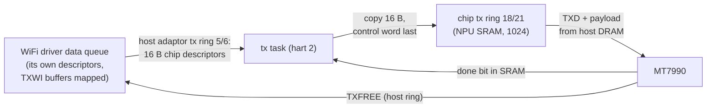
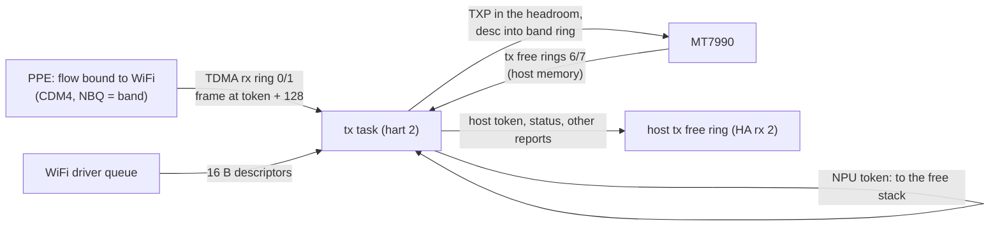

# Firmware

One image per SoC. RV32IMAC harts, code and task-private state in DRAM, `.data`/`.bss` and the debug
block in cluster SRAM.

## Layers

| dir | content |
|---|---|
| `arch/rv32` | `crt0.S` (gp, trap vector, per-hart 4 KB stack), `trap.S`, `link.ld.S` |
| `plat` | `plat.h` API; `npu/` the SoC blocks (MIB, mailbox, PLIC, UART, D-cache line ops); `qemu/` the test machine |
| `soc/<soc>` | harts, SRAM and cluster sizes, debug block offset, PLL decode |
| `core` | hart bring-up, task runner, SPSC rings, SRAM arena, trap handling, core map, `fw_info` |
| `ctl` | boot handshake, command ring, event ring, control service, capabilities, health |
| `dbg` | debug block, debug service (peek, poke, hardware probes) |
| `lib` | string, formatter, console |

## Boot

The host reads no NPU register between the trigger and `ready`: the bus reset would hang it.

## Execution

- A hart runs its tasks round robin: `int run(struct task *, int budget)` returns work done.
- Per task in the debug block: passes, work, busy and idle cycles (64-bit), errors. The runner keeps
  the task table and the counters on its own stack and only stores to the record: no shared load per
  pass.
- Park: hart 0 sets a flag, the hart parks at the top of its loop (`wfi`, interrupts off).

| hart | tasks |
|---|---|
| 0 | `ctl` (commands, event flush), `health` (faults, stalls), `dbg` |
| 1 | `rx`: RXDMAD_C walk, to the PPE or the host task (WLAN) |
| 2 | `tx`: host tx descriptors, LAN to WiFi, tx free reports (WLAN) |
| 3 | `host`: host rx ring, interrupt moderation (WLAN) |
| 4 | `buf`: id pool, rx ring refill, host return ring, PPE return FIFO (WLAN) |
| 1..5 | `dbg` (probe target) |

## Hand-offs and memory

- SPSC ring: `head` and `tail` on separate 32-byte lines; each side caches the other's index and
  reloads it only when the ring looks full or empty. Batches publish once.
- Arena: first-fit block table (64 blocks), zeroed blocks, freed per owner (radio, service). Only
  hart 0 allocates. Two arenas: NPU SRAM and cluster SRAM above `.bss`.
- D-caches are per hart and not coherent: state two harts touch stays in SRAM.

### Where state lives

| state | place | load cost (cycles) | rule |
|---|---|---|---|
| a task's own state (indices, SPSC handles, id pools it owns, ring geometry, counters) | `__hart_local`: `.bss.hart`, cached DRAM | ~10 hit | one hart only; each object on its own 64-byte lines |
| state another hart or the host reads (radio state, acks, stats, `delivered`) | `.bss`, cluster SRAM | 17 | written by one task, read by others |
| SPSC rings, descriptors, id stacks, per-station limits | NPU SRAM (arena) | 18 | shared or chip-visible |
| host rings and buffers | host DRAM | 98 uncached, ~10 cached after `FC2` | cached only per the line-op rules |

- A task copies what attach fixed (ring geometry, pool, moderation) at its reset, and takes the id
  pool it owns from then on. Control changes after attach reach it by a generation count
  (`aqm_gen`) or by a flag read once per pass (force host).
- Counters the host reads are kept in the task's state and stored, never loaded and incremented.
- SPSC handles keep the ring's mask, entry shift and base; a batch writes slot `k` only while
  `spsc_room(p, k + 1) > k`, and publishes once (rx: every 16 entries and at the pass end).
- Ring indices wrap by compare: rings need not be powers of two, and the host's index is reduced
  only when out of range. No division on a per-frame path.

## WLAN datapath (`rro31`, MT7990/MT7992)

- Attach places the chip rings per PCIe link in NPU SRAM and opens that link's inbound window;
  buffers are `pool + id * 2048`, one fixed pool the host maps. The host sets the headroom and the
  chip's buffer length (`rx_headroom`, `rx_buf_len`); ids set in the `rx_held` bitmap stay out of
  the pool, count as with the host, and join it when they come back on the return ring.
- rx: a whole 802.3 frame without a chip flag goes to the PPE (two SRAM stores, the cpu index
  once per burst); repeated and old frames are dropped, PN failures reach the host as errors,
  every other indication reason is a good frame. A full TDMA ring stops the walk (no drop).
- buffer: bound FIFO entries free the id; unbound ones go to the host with the FOE entry and CPU
  reason (the WiFi driver binds on reason 0x0F). The CRSN mask holds only 0x1F, "hit a bound entry".
- stop: every task drains, the frame engine returns every id; the audit accounts each id (pool,
  chip, host, transit, frame engine).
- Counters (`GET_STATS`): completions per indication reason, stale drops, host ring, refills per
  band, PPE sent/bound/unbound/full, unbound returns per CPU reason.

### Host tx

- A host tx entry is the chip descriptor the WiFi driver would write: TXWI address, `0x4C4048` (76-byte TXWI,
  72-byte head, last), frame head address, info. Nothing but the descriptor is copied.
- The host entry is free as soon as it is copied; the consumer index is published per batch with
  the chip's cpu index.
- Slots come back by the chip's done bit in SRAM (no bus read); 8 slots stay free ahead of its
  descriptor prefetch; a descriptor whose done bit reads back set is written again (`tx_rewrite`).
- Start reads the chip's dma index once and fails past the ring. Stop waits for the chip to take
  every slot, 50 ms at most; the audit reports `tx_chip` and `tx_host` left behind.

### Tx free and LAN to WiFi

- **Tx free rings stay in host memory** (the chip writes no report to rings in NPU SRAM, and then
  stops all DMA). The host arms them; the NPU starts at the slot after the host's empty slot (its
  cpu index), moves each taken slot's buffer to the empty slot and publishes the new empty one, as
  the host driver does; an empty slot inside the chip's prefetch stops it.
- Reports: NPU tokens back to the free stack; host tokens and station status as 8-byte host records;
  any other report (tx status, events) passed on whole after an event record.
- **LAN to WiFi:** 8192 NPU tokens, buffers in `tx-pkt`; the frame engine writes at +128, the tx task
  writes the TXP (flags `0x80` and token, BSS, wcid, one buffer, length) after an all-zero TXD and
  queues `{buf, 0x4C4048, buf + 128, 0}`. TDMA rx descriptors: word 1 done bit 31 and length, word 2
  buffer, word 4 band 25 and wcid 24:14, word 6 BSS 30:24.
- A slot takes a fresh token before its frame goes; no token or no ring room: the frame waits.
- The frame engine's TDMA rx index survives a detach: attach starts from it. Stop and detach turn TDMA
  rx off (TDMA global bit 2).
- **Per-station limit** (`wlan/aqm.c`, stations by wcid < 1024): sent and freed counts; the delay is
  the chip's own, from each tx free report's group header (bits 11:0, ms from queued to released, host
  frames included), and one frame is watched so that a stall without reports counts too. A hard
  limit, and CoDel once the queue stands (at least 64 frames and the delay at least 10 ms)
  for 100 ms: drops spaced interval / sqrt(count), frames of 256 bytes or less pass. The drop happens
  before a token is taken. `WLAN_AQM` reads and sets the parameters, `WLAN_STA_Q` gives a station's
  frames and delay in the chip. Only LAN to WiFi frames are dropped (mac80211 and AQL queue host frames).

## Host channel

| object | where | writer |
|---|---|---|
| boot block (magic, rings, `ready`, versions, ring indices, per-hart fault words) | host DRAM | host, then NPU fields |
| command ring, 32 x 256 B | host DRAM | host; NPU writes `status`, `rsp_len`, payload |
| event ring, 256 x 32 B | host DRAM | NPU |
| doorbell host to NPU | mailbox queue 0 `CTRL2` | host |
| interrupt NPU to host | mailbox queue 8 `CTRL2` | NPU |

- Commands run in ring order on hart 0. Unknown service or opcode: `-EOPNOTSUPP`; short or long
  payload: `-EINVAL`. A handler may answer later (`CMD_ASYNC`, e.g. `RESET`, probes).
- Events: room for one `CMD_DONE` per command slot is reserved, other events are dropped when only
  that room is left. The host interrupt is raised only when the host had caught up with the last
  publish, at most once per 50 us unless urgent.
- Faults: a trap records `mcause/mepc/mtval/ra/sp` in the debug block and the boot block fault word,
  then parks the hart. Hart 0's health task turns another hart's fault into a `FATAL` event, and a
  heartbeat stuck for 100 ms into `TASK_STALL`.

## Debug block (cluster SRAM, `dbg_offset` in the image header)

| offset | content |
|---|---|
| 0x000 | magic `DBG2`, version, size, harts, task count, trace head |
| 0x040 | per hart: state, heartbeat, task count, trap record |
| 0x1c0 | per task: hart, id, passes, work, busy/idle cycles, errors |
| 0x3c0 | trace ring, 64 x 16 B (hart 0 only): boot, commands, drops, faults, stalls, park |

## Debug service (debug images, `SVC_F_DBG`)

| command | does |
|---|---|
| `PEEK` / `POKE` | NPU address, faults caught (`-EFAULT`) |
| `PROBE CYCLES` | loop cost, CPU MHz |
| `PROBE LOAD` | cycles for N loads at a stride, two passes |
| `PROBE WFI` | target arms its mailbox wake and sleeps; hart 0 raises it after a delay |
| `PROBE XHART` | target writes a line cached; hart 0 reads it cached and uncached, then after write-back |
| `PROBE CLUSTER` | first cluster SRAM offset that aliases or faults |

## Image

128-byte header (`struct libranpu_img_hdr`), then code (text + rodata) and data. `scripts/mkimage.py`
fills it from the ELF; capability bits come from `fw_info` (`core/info.c`), the one place the build
config becomes capabilities. CRC32 covers header bytes 0..123 and both sections.
