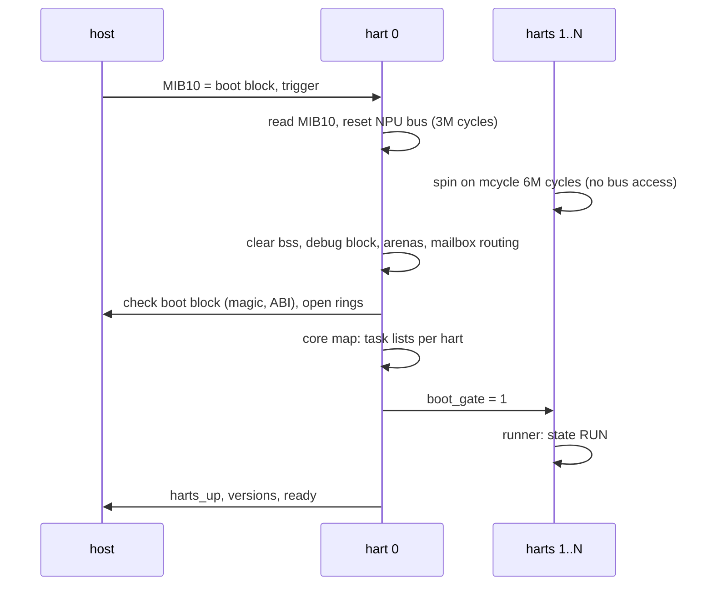

# Firmware

One image per SoC. RV32IMAC harts, code in DRAM, `.data`/`.bss` and the debug block in cluster SRAM.

## Layers

| dir | content |
|---|---|
| `arch/rv32` | `crt0.S` (gp, trap vector, per-hart 4 KB stack), `trap.S`, `link.ld.S` |
| `plat` | `plat.h` API; `npu/` the SoC blocks (MIB, mailbox, PLIC, UART, D-cache line ops); `qemu/` the test machine |
| `soc/<soc>` | harts, SRAM and cluster sizes, debug block offset, PLL decode |
| `core` | hart bring-up, task runner, SPSC rings, SRAM arena, trap handling, core map, `fw_info` |
| `ctl` | boot handshake, command ring, event ring, control service, capabilities, health |
| `dbg` | debug block, debug service (peek, poke, hardware probes) |
| `lib` | string, formatter, console |

## Boot

The host reads no NPU register between the trigger and `ready`: the bus reset would hang it.

## Execution

- A hart runs its tasks round robin: `int run(struct task *, int budget)` returns work done.
- Per task in the debug block: passes, work, busy and idle cycles (64-bit), errors.
- Park: hart 0 sets a flag, the hart parks at the top of its loop (`wfi`, interrupts off).

| hart | tasks |
|---|---|
| 0 | `ctl` (commands, event flush), `health` (faults, stalls), `dbg` |
| 1..N | `dbg` (probe target) |

## Hand-offs and memory

- SPSC ring: `head` and `tail` on separate 32-byte lines; each side caches the other's index and
  reloads it only when the ring looks full or empty. Batches publish once.
- Arena: first-fit block table (64 blocks), zeroed blocks, freed per owner (radio, service). Only
  hart 0 allocates. Two arenas: NPU SRAM and cluster SRAM above `.bss`.
- D-caches are per hart and not coherent: state two harts touch stays in SRAM.

## Host channel

| object | where | writer |
|---|---|---|
| boot block (magic, rings, `ready`, versions, ring indices, per-hart fault words) | host DRAM | host, then NPU fields |
| command ring, 32 x 256 B | host DRAM | host; NPU writes `status`, `rsp_len`, payload |
| event ring, 256 x 32 B | host DRAM | NPU |
| doorbell host to NPU | mailbox queue 0 `CTRL2` | host |
| interrupt NPU to host | mailbox queue 8 `CTRL2` | NPU |

- Commands run in ring order on hart 0. Unknown service or opcode: `-EOPNOTSUPP`; short or long
  payload: `-EINVAL`. A handler may answer later (`CMD_ASYNC`, e.g. `RESET`, probes).
- Events: room for one `CMD_DONE` per command slot is reserved, other events are dropped when only
  that room is left. The host interrupt is raised only when the host had caught up with the last
  publish, at most once per 50 us unless urgent.
- Faults: a trap records `mcause/mepc/mtval/ra/sp` in the debug block and the boot block fault word,
  then parks the hart. Hart 0's health task turns another hart's fault into a `FATAL` event, and a
  heartbeat stuck for 100 ms into `TASK_STALL`.

## Debug block (cluster SRAM, `dbg_offset` in the image header)

| offset | content |
|---|---|
| 0x000 | magic `DBG2`, version, size, harts, task count, trace head |
| 0x040 | per hart: state, heartbeat, task count, trap record |
| 0x1c0 | per task: hart, id, passes, work, busy/idle cycles, errors |
| 0x3c0 | trace ring, 64 x 16 B (hart 0 only): boot, commands, drops, faults, stalls, park |

## Debug service (debug images, `SVC_F_DBG`)

| command | does |
|---|---|
| `PEEK` / `POKE` | NPU address, faults caught (`-EFAULT`) |
| `PROBE CYCLES` | loop cost, CPU MHz |
| `PROBE LOAD` | cycles for N loads at a stride, two passes |
| `PROBE WFI` | target arms its mailbox wake and sleeps; hart 0 raises it after a delay |
| `PROBE XHART` | target writes a line cached; hart 0 reads it cached and uncached, then after write-back |
| `PROBE CLUSTER` | first cluster SRAM offset that aliases or faults |

## Image

128-byte header (`struct libranpu_img_hdr`), then code (text + rodata) and data. `scripts/mkimage.py`
fills it from the ELF; capability bits come from `fw_info` (`core/info.c`), the one place the build
config becomes capabilities. CRC32 covers header bytes 0..123 and both sections.
