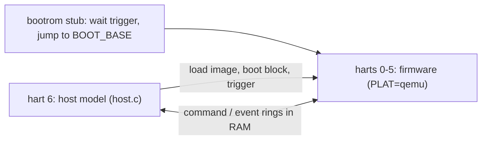

# Testing

| level | run | covers |
|---|---|---|
| unit | `make -C tests/unit` (gcc -m32, UBSan) | arena, SPSC (incl. 2M entries across two threads), formatter |
| QEMU | `tests/qemu/run.sh` | the QEMU image on 6 harts + a host model hart: load, boot, commands, burst of 96, errors, peek/poke, faults, probes, reset |
| DUT | by hand on the DUT | boot, reload loops, probes, command latency |

## QEMU harness

- `PLAT=qemu` moves NPU SRAM, cluster SRAM and the NPU register window into RAM at `0x8E800000`,
  `0x8E900000` and `0x8EC00000`, so the host model uses the real register offsets.
- A locked PMP entry makes `0xF0000000+` fault, for the fault-catching paths.
- The hart wake source is the CLINT software interrupt; `wfi` really sleeps.
- QEMU timing is not the NPU's; the harness checks logic and ordering only.

## DUT results (AN7583, 720 MHz)

| item | result |
|---|---|
| ready after trigger | 8.3 / 8.7 / 8.8 ms (min / median / max, 50 reloads) |
| command round trip | 24 / 51 / 90 us (min / avg / max) |
| load cost, cycles | NPU SRAM 18, cluster SRAM 17, cached DRAM hit 10, miss 83-117, uncached DRAM 98, MMIO 26 |
| `wfi` | stops the hart and `mcycle`; its mailbox queue wakes it |
| D-cache | per hart, write-back, not coherent between harts |
| cluster SRAM | 32 KB, mirrored every 32 KB |
