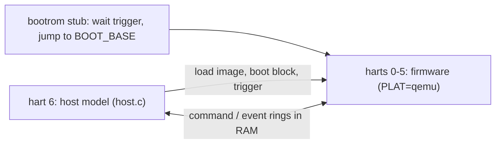

# Testing

| level | run | covers |
|---|---|---|
| unit | `make -C tests/unit` (gcc -m32, UBSan) | arena, SPSC (incl. 2M entries across two threads, batch room), id pool, per-station limit, formatter; tests rebuild when a firmware header changes |
| QEMU | `tests/qemu/run.sh` | the QEMU image on 6 harts + a host model hart: load, boot, commands, burst of 96, errors, peek/poke, faults, probes, reset; WLAN with a chip model and a frame engine model (descriptors, pad, bind 1 in 3, FIFO), both bands, chains, indication reasons, stats, stop audit, re-attach, force host |
| DUT | by hand on the DUT | boot, reload loops, probes, command latency |

## QEMU harness

- `PLAT=qemu` moves NPU SRAM, cluster SRAM and the NPU register window into RAM at `0x8E800000`,
  `0x8E900000` and `0x8EC00000`, so the host model uses the real register offsets.
- A locked PMP entry makes `0xF0000000+` fault, for the fault-catching paths.
- The hart wake source is the CLINT software interrupt; `wfi` really sleeps.
- QEMU timing is not the NPU's; the harness checks logic and ordering only. Checks do not depend on
  how fast the firmware runs against the host model (they hold with every firmware access instrumented).
- There is no cache: `plat_dcache_inv`/`plat_dcache_wb_inv` store the line address to
  `0x8EC13100`/`0x8EC13104`, so an instrumented QEMU can model the D-cache and catch stale reads.
  `run.sh` passes its arguments to QEMU (e.g. `-plugin file=...`).
- Band 1's tx free report buffers start 40 bytes into a line: reports cross lines.
- Faults: a `HANG` probe on hart 3 past the 100 ms limit must raise TASK_STALL and the heartbeat must
  resume; a `TRAP` probe on hart 5 must raise FATAL with its task and cause. RESET then answers with
  hart 5 missing from the parked mask.

## DUT results (AN7583, 720 MHz)

| item | result |
|---|---|
| ready after trigger | 8.3 / 8.7 / 8.8 ms (min / median / max, 50 reloads) |
| command round trip | 24 / 51 / 90 us (min / avg / max) |
| load cost, cycles | NPU SRAM 18, cluster SRAM 17, cached DRAM hit 10, miss 83-117, uncached DRAM 98, MMIO 26 |
| `wfi` | stops the hart and `mcycle`; its mailbox queue wakes it |
| D-cache | per hart, write-back, not coherent between harts |
| cluster SRAM | 32 KB, mirrored every 32 KB |

WLAN (MT7990, two PCIe links, commit `0f055f3`):

| item | result |
|---|---|
| rx to the host, per client | 5 GHz 751-898 / 418-566, 2.4 GHz 94-153 Mb/s: host-path parity |
| MTU 2304 | 1472-2276 B frames (two-segment chains) both ways, 0 % loss |
| WiFi to WAN through the PPE | 560-662 Mb/s at 11-14 % DUT CPU; host path 586-624 Mb/s at 49-52 % |
| bound flow | 99.3 % of its frames forwarded by the PPE |
| NPU cost | rx task ~450 cycles per frame at ~48 k frames/s (3 % of its hart) |

Zero-copy rx (commit `3ca6361`, 5 GHz EHT160 2SS client, 3 interleaved runs of 10 s per cell,
`wlan_rx_lend` switched at run time, force host on):

| path | lend | Mb/s | DUT CPU | CPU % per Mb/s |
|---|---|---|---|---|
| bridged to a wired peer | on | 787 | 45.7 % | 0.058 |
| bridged to a wired peer | off (copy) | 799 | 52.5 % | 0.066 |
| to a DUT socket | on | 1307 | 77.1 % | 0.059 |
| to a DUT socket | off (copy) | 1140 | 84.0 % | 0.074 |

| check | result |
|---|---|
| integrity | 9.3 M lent frames bridged and local; the wired peer's TCP checksum errors unchanged |
| chains | 1400-2000 B pings (two-buffer frames, head + page frag) to both 5 GHz clients |
| stopped socket, 1345 lent | the WiFi driver and `libranpu` reloaded under it: 1830 ids held (915 pages); after the socket closed all came back, NPU `buf_returned` = host copied + reclaimed |
| lend limit | a stopped socket holding 9 MB reaches 4608 of 4608; other clients keep their rate by copy, the chip never runs short (`buf_empty` 0) |
| detach audit | no lost or expired ids |

Host tx through the NPU (commit `5a3cac7`), DUT transmits, 10 s TCP, NPU tx
vs the host driving the same rings in the same session:

| path | client | NPU tx | host rings |
|---|---|---|---|
| bridged wired peer to client | 5 GHz EHT160 | 742, 896 Mb/s at 0.098 % CPU per Mb/s | 918, 763 at 0.098 |
| DUT socket to client | 5 GHz EHT160 | 917, 894 at 0.073 | 939, 899 at 0.074 |
| wired peer to client, UDP ceiling | 2.4 GHz | 91-124 Mb/s | 85-135 |

| check | result |
|---|---|
| frames up to 2000 B (client MTU) | pass on both bands |
| L1 SER idle and under a 900 Mb/s tx flow | recovers; under traffic the stop times out (chip paused), 8 chip and 31 host descriptors dropped, flow back within 2 s |
| detach audit after traffic | clean |

Tx free and LAN to WiFi (commit `89650a1`), TCP 10 s, DUT routes WAN to LAN:

| path | client | NPU (PPE bound) | host path (software flow offload) |
|---|---|---|---|
| WAN to WiFi | 5 GHz EHT160 | 1.32-1.49 Gb/s at ~5 % CPU | 929-970 Mb/s at 79-83 % |
| WAN to WiFi | 2.4 GHz | 139-161 Mb/s | 85-94 Mb/s |
| WiFi to WAN | 5 GHz EHT160 | 611-674 Mb/s at ~4.5 % | 591-630 Mb/s at ~41 % |
| LAN to WiFi, bridged | 5 GHz EHT160 | 895 Mb/s at 8 % (1 GbE wired link) | ~900 Mb/s at ~90 % |

| check | result |
|---|---|
| host tx with NPU tx free | parity with NPU tx (bridged 0.101 vs 0.098 % CPU per Mb/s) |
| tokens | every NPU token back (`txfree_npu` = `lan_frames`) |
| L1 SER under 1.4 Gb/s WAN to WiFi | flow back within 2 s, tokens all back |
| re-attach | LAN to WiFi resumes from the frame engine's index |

Per-station limit (commit `522f123`), 16 TCP streams WAN to the 2.4 GHz client, `wlan_sta_q` sampled
each second:

| limit | frames in the chip, avg (max) | delay in the chip, avg (max) | Mb/s |
|---|---|---|---|
| off | 694 (1265), 1653 (5397) | 41 ms (70), 152 ms (376) | 133, 140 |
| on | 278 (491), 357 (529) | 19 ms (28), 16 ms (27) | 130, 138 |

With 4 streams the chip holds 56-373 frames (3-16 ms) and the limit rarely acts; the DUT's ping to
the client (~90 ms average, a 1 s outlier each run) is dominated by queues outside the NPU.
